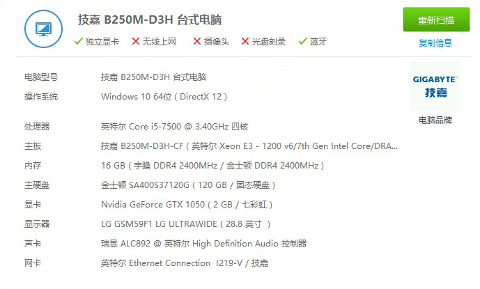
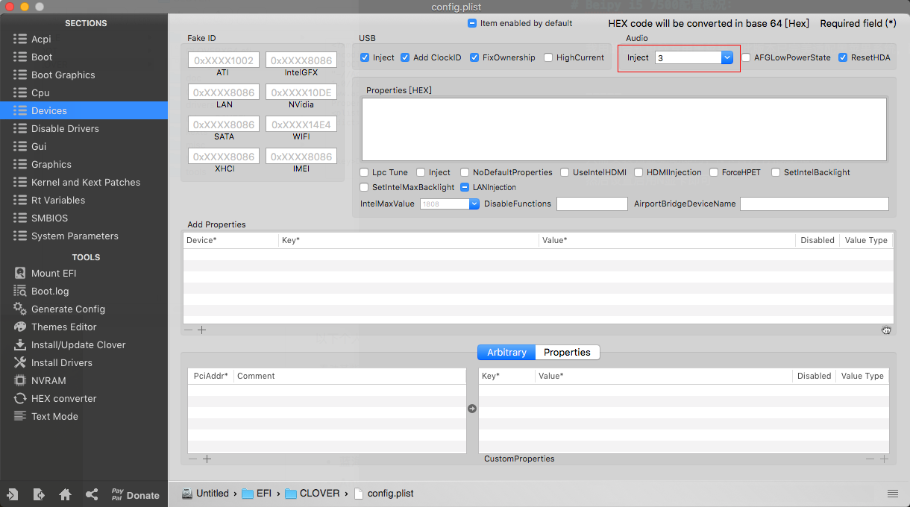

# Beipy i5 7500配置概况：

我用的台式电脑专用黑苹果，此版本已完美适配黑苹果系统，配置如下图：

-----

##显卡

只需安装独显驱动即可，N卡官方有相应Mac驱动：
然后设置启用N显卡即可如图设置此处：

-----

##声卡

声卡设置如下：因本配置使用的是声卡ALC 892
 
去目录：kexts>Other>AppleALC.kext>content文件内找到：Info.plist文件使用记事本打开搜索🔍：相应的声卡型号逐个测试`<integer>5</integer>`中的数值如图：

-----

