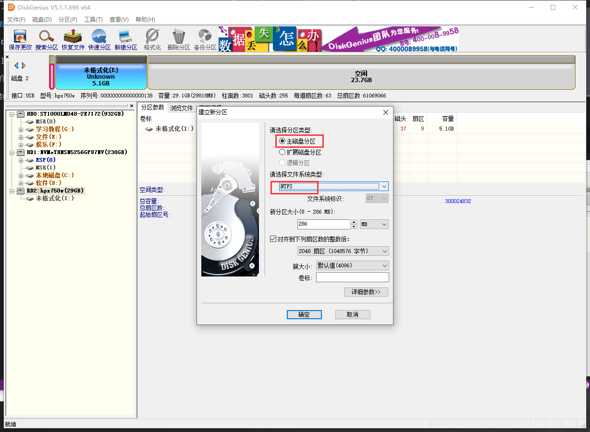

# Beipy i5 7500配置概况：

我用的台式电脑专用黑苹果，此版本已完美适配黑苹果系统，配置如下图：

-----

## 显卡

只需安装独显驱动即可，N卡官方有相应Mac驱动：
然后设置启用N显卡即可如图设置此处：

-----

## 声卡

声卡设置如下：因本配置使用的是声卡ALC 892
 
去目录：kexts>Other>AppleALC.kext>content文件内找到：Info.plist文件使用记事本打开搜索🔍：相应的声卡型号逐个测试`<integer>5</integer>`中的数值如图：

-----

## 操作教程

### 第一步，准备 

    找一个大于8G的U盘。

### 第二步 制作U盘安装包，

    使用软件，`balenaEtcher-Portable-1.5.18-x64`

### 第三步 修改刻录的U盘，EFI引导磁盘

    使用软件，`DiskGenius.exe`，删除U盘原来的EFI引导磁盘。

    把刚才删除的分区位置，鼠标右键>建立新分区>按照下图设置>保存更改。

### 第四步 把文件EFI复制进去。

    1. 使用软件，`DiskGenius.exe`挂着EFI分区，或者直接使用DiskGenius.exe复制进去。

### 第五步 重启，抹磁盘

    进入安装工具后，打开磁盘工具>显示所有设备>找到想要装的磁盘，进行下一步抹除磁盘

    找到磁盘后进行抹除磁盘，如下图，
    名称：Macintosh HD   
    格式：APFS
    方案：GUID分区图

### 第六步 开始安装

    关掉磁盘工具，拔掉网线，开始安装，不传输数据，不登录ID

进入系统后，安装WEb Driver N卡驱动。